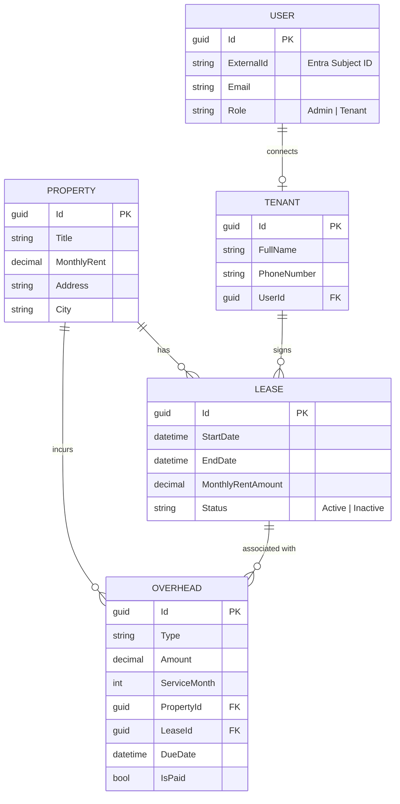

```mermaid
erDiagram

    PROPERTY ||--o{ LEASE : has
    PROPERTY ||--o{ OVERHEAD : incurs
    TENANT ||--o{ LEASE : signs
    LEASE ||--o{ OVERHEAD : "associated with"
    USER ||--o| TENANT : connects

    PROPERTY {
        guid Id PK
        string Title
        decimal MonthlyRent
        string Address
        string City
    }
    TENANT {
        guid Id PK
        string FullName
        string PhoneNumber
        guid UserId FK
    }
    LEASE {
        guid Id PK
        datetime StartDate
        datetime EndDate
        decimal MonthlyRentAmount
        string Status "Active | Inactive"
    }
    OVERHEAD {
        guid Id PK
        string Type
        decimal Amount
        int ServiceMonth
        guid PropertyId FK
        guid LeaseId FK
        datetime DueDate
        bool IsPaid
    }
    USER {
        guid Id PK
        string ExternalId "Entra Subject ID"
        string Email
        string Role "Admin | Tenant"
    }
    
```